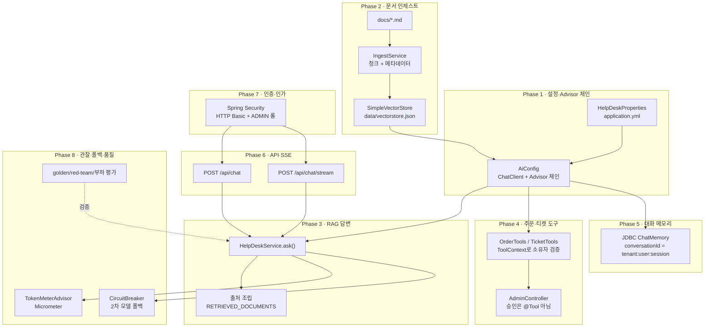
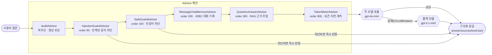

# SKALA HelpDesk AI

RAG · Tool 호출 · 대화 메모리 · 안전 가드레일 · 관찰(Observability)을 하나의 상담
에이전트로 조립한 독립 Spring Boot 프로젝트입니다. SKALA SpringAI 과정의 종합 실습
과제이며, Phase 1~8 순서로 단계마다 하나의 기능을 완성해 나갑니다.

## 아키텍처

### Phase 1~8 흐름



### Advisor 체인 파이프라인

`ChatClient` 하나에 걸린 Advisor는 `order` 값 순서로 실행됩니다(코드 상 나열 순서가 아님).
차단은 항상 메모리 저장(200)보다 앞에 있어야 막힌 문장이 대화 기록에 남지 않습니다.



## 패키지 구조

```
com.skala.helpdesk/
├─ HelpDeskApplication.java
├─ SeedDataRunner.java          데모 주문 시딩
├─ config/   HelpDeskProperties, AiConfig, VectorStoreConfig, SecurityConfig
├─ web/      ChatController, AdminController, GlobalChatExceptionHandler
├─ chat/     HelpDeskService, ChatRequest, AnswerDto
├─ domain/   Order, Ticket
├─ repository/ OrderRepository, TicketRepository
├─ rag/      IngestService, PolicyDocsRunner
├─ tools/    OrderTools, TicketTools, ToolUsage
└─ advisor/  AuditAdvisor, AuditLog, InjectionGuardAdvisor, TokenMeterAdvisor
```

## 실행 방법

### 환경변수

| 변수 | 필수 | 기본값 | 설명 |
| --- | --- | --- | --- |
| `OPENAI_API_KEY` | 채팅·인제스트에 필수 | `not-set` | 없어도 앱은 뜨지만, 실제 모델·임베딩 호출 시점에 401이 난다 |
| `HELPDESK_PRIMARY_MODEL` | 선택 | `gpt-4o-mini` | 주 모델 |
| `HELPDESK_FALLBACK_MODEL` | 선택 | `gpt-4.1-mini` | 폴백 모델(주 모델과 반드시 다르게 설정할 것) |

### 기동

```bash
export OPENAI_API_KEY="sk-..."
./gradlew bootRun
```

첫 기동 시 `data/vectorstore.json` 스냅샷이 없으면 `docs/*.md`를 자동으로 인제스트합니다
(임베딩 API를 1회 호출). 이후 재기동에서는 스냅샷을 그대로 불러와 비용을 아낍니다. 문서를
수정한 뒤에는 관리자 계정으로 `POST /api/admin/ingest`를 호출해 수동 재인제스트하세요.

### 기본 계정 (Phase 7, HTTP Basic)

| 계정 | 비밀번호 | 롤 |
| --- | --- | --- |
| `user1` | `user1234` | USER |
| `admin1` | `admin1234` | USER, ADMIN |

### 빠른 확인

```bash
# 상담(동기)
curl -u user1:user1234 -X POST localhost:8080/api/chat \
  -H "Content-Type: application/json" \
  -d '{"sessionId":"s1","message":"단순 변심 반품은 며칠 이내인가요?"}'

# 상담(SSE 스트리밍)
curl -N -u user1:user1234 -X POST localhost:8080/api/chat/stream \
  -H "Content-Type: application/json" \
  -d '{"sessionId":"s1","message":"제 주문 12345는 지금 어디예요?"}'

# 관리자 — 인제스트된 청크 확인
curl -u admin1:admin1234 "localhost:8080/api/admin/chunks?q=반품&topK=5"

# 관리자 — 승인 대기 티켓 확인/승인
curl -u admin1:admin1234 localhost:8080/api/admin/tickets/pending
curl -u admin1:admin1234 -X POST localhost:8080/api/admin/tickets/1/approve
```

## API

| 메서드 | 경로 | 인증 | 설명 |
| --- | --- | --- | --- |
| POST | `/api/chat` | 로그인 필요 | 구조화 응답(`answer`, `sources`, `toolUsed`) |
| POST | `/api/chat/stream` | 로그인 필요 | SSE — `token` 이벤트 스트리밍 후 마지막에 `sources` 이벤트 |
| GET | `/api/admin/chunks` | ADMIN | 벡터스토어에 실제로 들어간 청크 미리보기 |
| POST | `/api/admin/ingest` | ADMIN | 정책 문서 수동 재인제스트 |
| GET | `/api/admin/tickets/pending` | ADMIN | 승인 대기 티켓 목록 |
| POST | `/api/admin/tickets/{id}/approve` | ADMIN | 티켓 승인(모델은 이 경로에 절대 닿지 못한다) |

## 테스트

```bash
./gradlew test          # 무료 — 모델 호출 없음(슬라이스 테스트 + 모킹)
./gradlew test -Peval   # 유료 — 실제 OPENAI_API_KEY로 모델 호출(golden/red-team/부하/장애주입)
```

**알려진 범위 제한**: 폴백 서킷브레이커는 동기 `/api/chat`(`HelpDeskService.ask()`)에만
적용됩니다. `/api/chat/stream`은 Reactor용 서킷브레이커 배선(`resilience4j-reactor`)이
별도로 필요해 이번 범위에서는 폴백을 적용하지 않았습니다.

## 완료 기준 체크리스트

| 요구사항 | 검증 방법 |
| --- | --- |
| 문서 근거로 답하고 출처를 표시한다 | `GoldenSetEvalTest` |
| 주문·티켓을 실시간 조회·생성한다 | `ToolAuthorizationTest`(무료) + 도구 호출 감사 로그 |
| 3턴 이상 맥락을 유지한다 | `HelpDeskScenarioEvalTest` |
| P95 응답 5초 이내(비스트리밍) | `LoadTestP95Test` |
| 질의당 평균 토큰 상한 준수(문서화, 강제 아님) | `/actuator/metrics/ai.tokens` |
| 인젝션·민감어 차단, 모든 도구 호출 감사 | `RedTeamEvalTest`(10종) + `AuditAdvisor`/`AuditLog` |
| 주 모델 장애 시 폴백으로 응답 지속 | `FaultInjectionFallbackTest` |
